# Task Planner Android App

## Идея
Task Planner е Android приложение за организиране, мониторинг и анализиране на ежедневни задачи. Потребителят може да управлява задачи в различни категории, да следи напредъка си чрез анимирани графики, да импортира задачи чрез вграден QR код скенер и да споделя структурирани отчети с външни приложения.

## Как работи
При стартиране приложението активира фонов корутинен контекст (`Dispatchers.IO`), който автоматично попълва локалната база данни с 5 примерни задачи, ако се стартира за първи път. Потребителят може да филтрира и управлява задачите по категории и приоритет, като всички промени се записват локално в Room база данни. 
При импортиране чрез QR кода, вграденият парсер разчита кодираната информация (JSON обект, текст с разделители или суров текст), конвертира я в задача и я записва автоматично. UI екраните наблюдават реактивни `Flow` потоци от ViewModel и се обновяват незабавно без презареждане.

## Архитектура
Проектът следва MVVM архитектура с Repository слой и Single Activity структура.
* **Model** – Task domain модел, `TaskEntity` за Room
* **View** – Фрагменти управлявани от Jetpack Navigation Component: TaskListFragment, TaskDetailFragment, TaskFormFragment, StatsFragment, QRScannerFragment
* **ViewModel** – TaskViewModel управлява UI state (предаван чрез Flow/LiveData) и потребителските действия
* **Repository** – TaskRepository медиатор между ViewModel и локалния източник на данни
* **Local data source** – Room database чрез AppDatabase и TaskDao
* **Dependency Injection** – Нишково-безопасен Service Locator шаблон за ръчно DI инжектиране

## Потребителски поток
* Потребителят отваря приложението и вижда текущия списък със задачи и обобщен прогрес.
* Може да филтрира задачите по категория (Work, Personal, Health, Study) и/или приоритет (High, Medium, Low).
* При клик върху бутона (+) се отваря форма за създаване на нова задача с краен срок.
* При избор на конкретна задача се отваря детайлен екран с възможност за редактиране, изтриване или споделяне.
* От долната навигация потребителят може да отвори екрана за статистика или да активира вградения QR скенер.
* При успешно сканиране на QR код с данни за задача, приложението я парсва, записва и връща потребителя към обновения списък.

## Технологии
| Технология | Версия | Използване |
| :--- | :--- | :--- |
| **Kotlin** | 2.2.10 | Основен език  |
| **Material 3** | 1.13.0 | UI компоненти |
| **Navigation Component** | 2.8.5 | Навигация |
| **ViewModel + Flow** | 2.8.5. | Управление на архитектурния state и реактивни потоци |
| **Room** | 2.8.4 | Локална SQLite база данни (Offline-first) |
| **ZXing / CameraX** | 4.3.0 | Сканиране и разчитане на QR кодове през камерата |

## Основни функционалности
* Пълен CRUD мениджмънт на задачи (заглавие, описание, категории, приоритети, краен срок)
* Автоматично първоначално попълване с 5 демо задачи при първи старт
* Интерактивен, персонализиран и анимиран кръгов прогрес индикатор за завършеност
* Смарт импорт на задачи чрез сканиране на QR кодове (JSON, текст с разделители, суров текст)
* Споделяне на структурирани текстови отчети за задачи чрез Android `ACTION_SEND` Intent
* Динамична Light/Dark тема и заоблени Material 3 контейнери
* Изцяло локална работа на приложението (Offline-first)

## Локална база данни
Приложението използва Room база данни с една основна таблица:
* `tasks` – съхранява всички атрибути на потребителските задачи.

Room се използва чрез DAO интерфейс:
* `TaskDao` – дефинира SQLite заявките (Insert, Update, Delete, Query за Flow обекти).

Данните се съхраняват персистентно и остават налични на устройството след рестарт.

## Стъпки за стартиране
1. Клонирайте репото:
   ```bash
   git clone https://github.com/rennie666/MobileApps2026--2301681001-.git
2. Отворете проекта в Android Studio (Ladybug/Hedgehog или по-нова версия).
3. Изчакайте Gradle да синхронизира и изтегли необходимите зависимости от Version Catalog.
4. Почистете и компилирайте проекта: 
    ```bash
    gradlew clean assembleDebug
5. Стартирайте приложението на емулатор или реално устройство: Bash./gradlew installDebug

## Изисквания:
* Min SDK: 24
* Target SDK: 35
* Java JDK: 17
* Camera Permission (за използване на QR скенера)

## Тестови акаунти
Не са необходими тестови акаунти. Приложението е проектирано с офлайн архитектура и не изисква login/register функционалности или отдалечена автентификация.

## Тестове
Проектът съдържа автоматизирани тестове, които могат да бъдат изпълнени чрез следните команди:
* Unit тестове (проверяват бизнес логиката и репозитори слоя): 
  ```bash
  gradlew testDebugUnitTest
* UI тестове (Espresso) (проверяват коректното зареждане и компонентите на интерфейса):
  ```bash
  gradlew connectedAndroidTest


## Скрийншотове

| 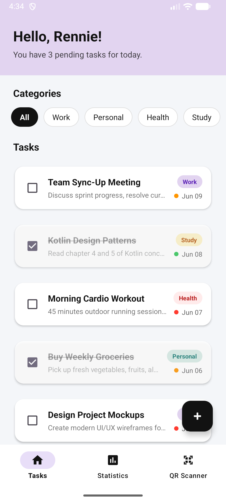 | 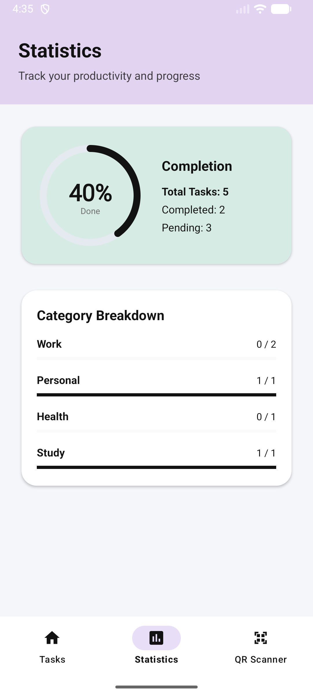 | 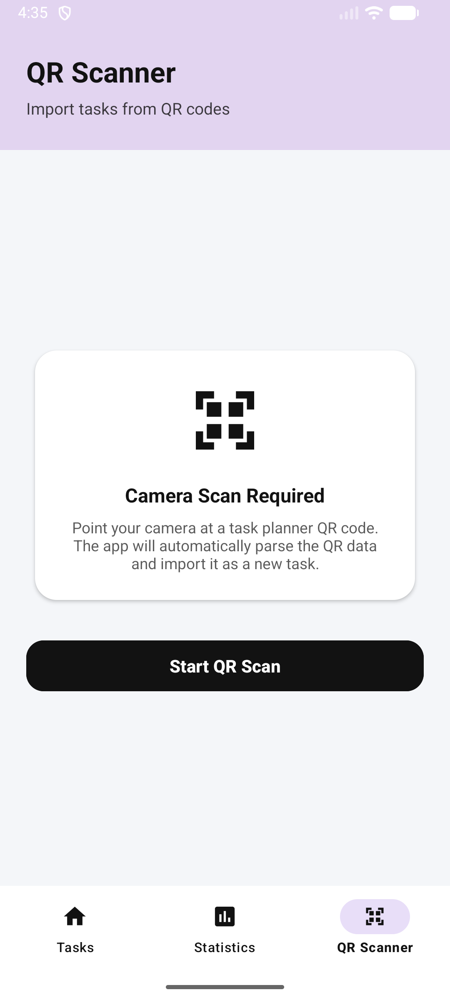 | 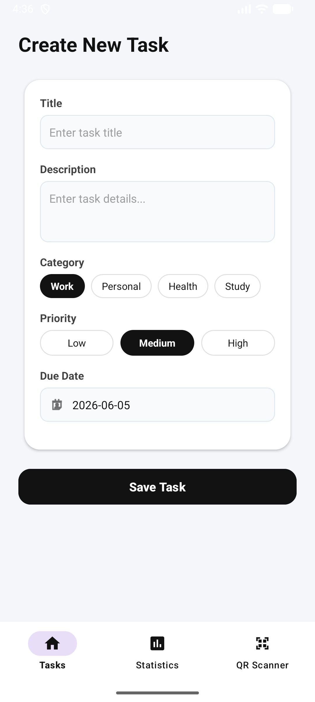 |
| :---: | :---: | :---: | :---: |
| 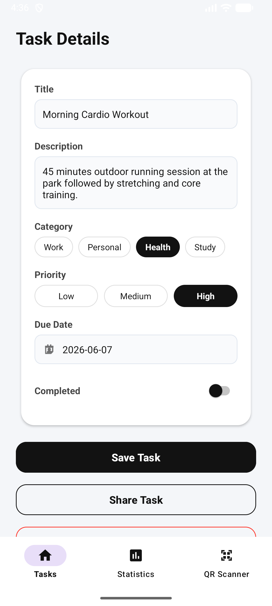 | 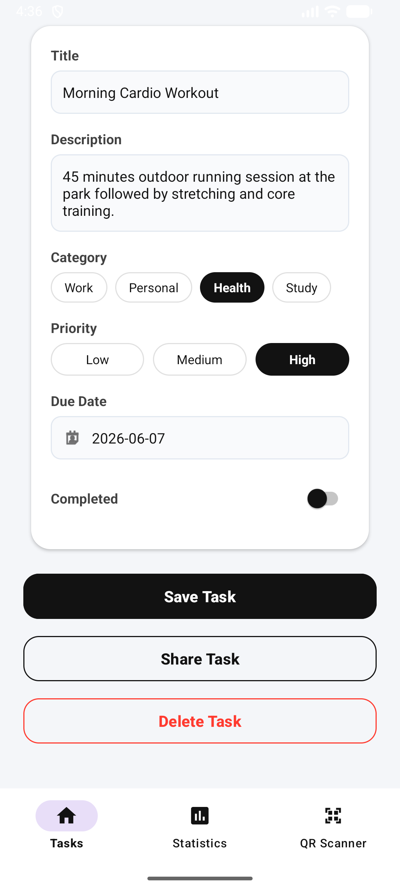 |  | 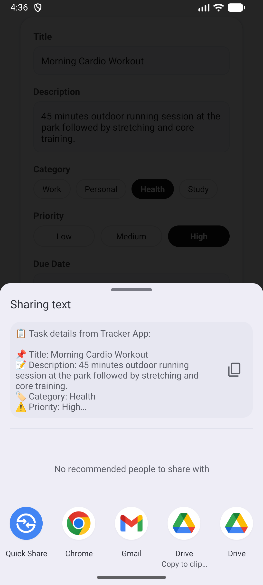
| 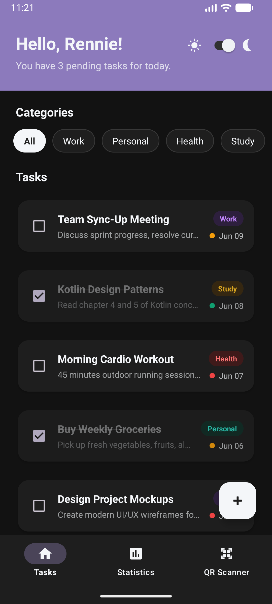 | 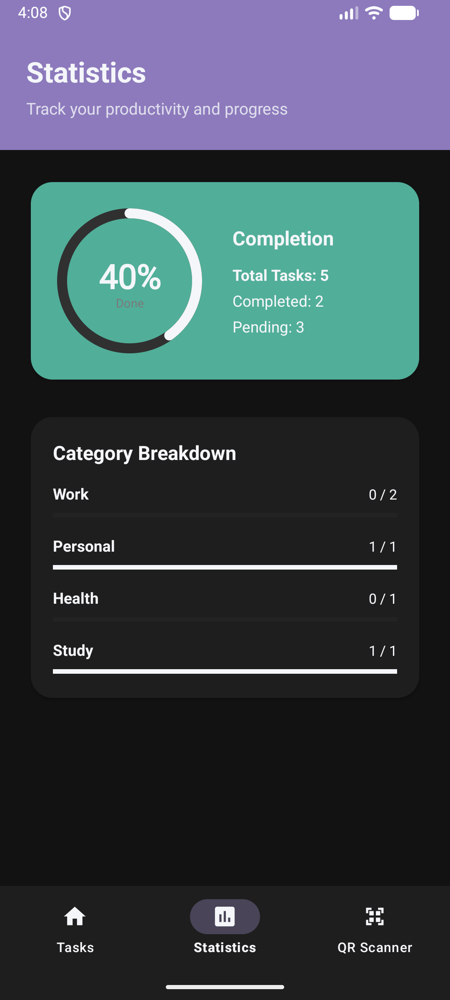 | 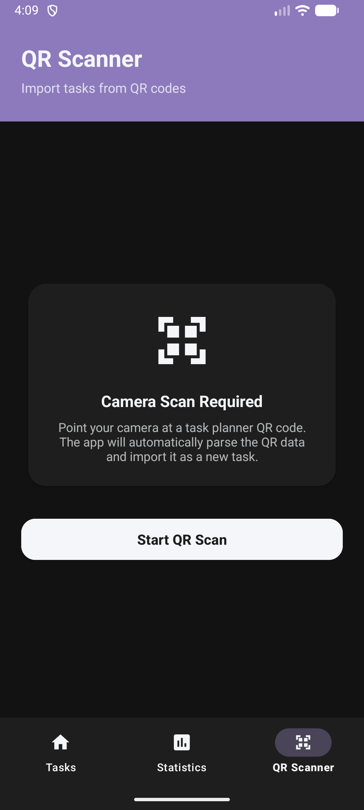 | 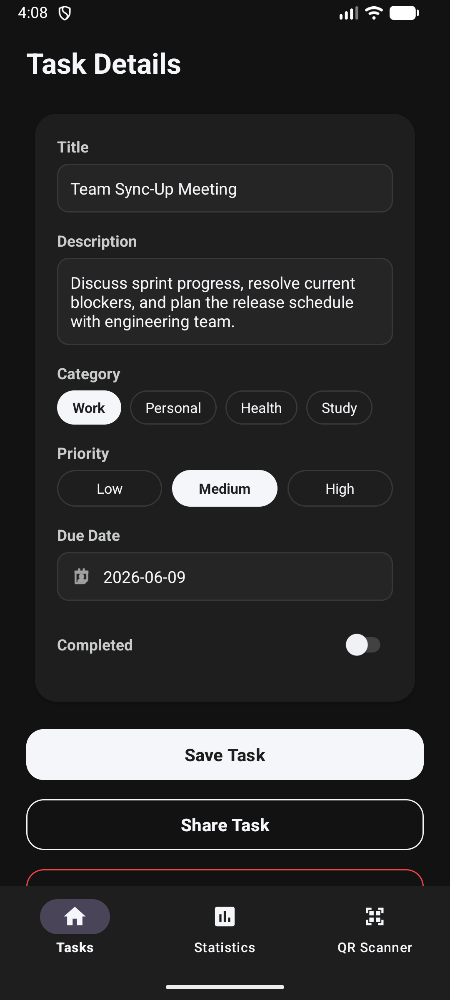 |

## APK
Компилираният готов файл за инсталация може да бъде намерен и изтеглен директно от:  [app-debug.apk](app/build/outputs/apk/debug/app-debug.apk)

## Автор
Проектът е разработен като курсова работа по Mobile Applications.

Факултетен номер: 2301681001
Репо: MobileApps2026--2301681001-